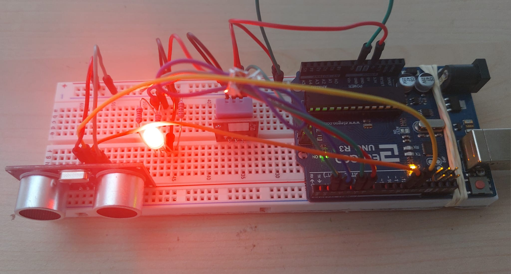

# ArduinoWindows
 

### Communicate between arduino and windows app

#### Description
The device read the temperature of a room and it displays in the windows app using serial port, The user can also controll 
the colors of the LED by clicking the crossponding buttons.

Demo video click  *[here](https://youtu.be/9zny0XfS3EM)*.

#### Arduino device
+ Read temprature of a room using DHT11 
+ Send the reading to an application connected with
+ User can change the color of RGBA LED by clicking button
+ When user clicked the application send character to arduino device R,G,B and O for Red, Green, Blue and Off respectively
+ *[Ultrasonic](https://arduinogetstarted.com/images/tutorial/ultrasonic-sensor-pinout.jpg)* sensor added, it is a device that measures the distance of an object placed infront of it 

#### Desktop Application

#### Circuit scheme

Code for the Microcontroller is found *[here](https://github.com/AbielKiflu/ArduinoWindows/blob/main/arduino/arduinoCode/arduinoCode.ino)*.

##### Components
1. DHT11 (1)
2. Wires (6)
3. RGB LED (1)
4. Ultrasonic
5. Arduino uno (1)

