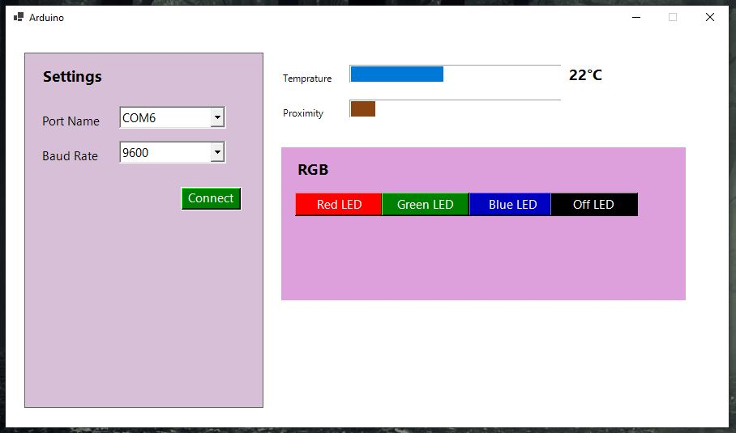

# ArduinoWindows

###Comunicate between arduino and windows app

#### Arduino device
1. Read temprature of a room using DHT11
2. Send the reading to an application connected with
3. User can change the color of RGBA LED by clicking button
4. When user clicked the application send character to arduino device R,G,B and O for Red, Green, Blue and Off respectively

#### Desktop Application

#### Circuit scheme

